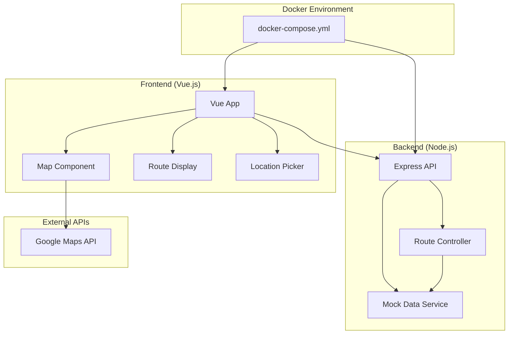

# Design Document

## Overview

台灣智慧交通展示系統是一個全棧展示專案，專門設計來展現符合 Metropia Inc. 職位需求的技術能力：

**核心展示重點：**
1. **Node.js 後端架構** - 展現 5+ 年後端開發經驗
2. **AI 輔助開發流程** - 完整展示 Claude/AI 工具在開發中的應用
3. **現代全棧技術** - TypeScript、Vue.js、Docker
4. **API 設計與文件** - RESTful API + Swagger 自動文件
5. **程式碼品質** - ESLint、Prettier、清晰的架構設計

## Architecture

### System Architecture



### Technology Stack

**Backend (展示 Node.js 專精):**
- Node.js 18+ + Express.js (RESTful API)
- TypeScript (型別安全 + 現代 JS)
- Swagger/OpenAPI 3.0 (API 文件自動生成)
- ESLint + Prettier (程式碼品質)
- Helmet + CORS (安全性)

**Frontend (現代前端技術):**
- Vue.js 3 + Composition API
- TypeScript + Vite (快速開發)
- Google Maps JavaScript API
- Tailwind CSS (現代 UI)
- Pinia (狀態管理)

**開發工具:**
- Docker + Docker Compose (本地開發)
- AI 輔助開發展示 (Claude Code 應用)

## Components and Interfaces

### Backend Components (展示架構設計能力)

#### 1. API Gateway (`/src/app.ts`) - 展示 Express.js 專精
```typescript
class APIGateway {
  private app: Express;
  private logger: Logger;
  
  constructor() {
    this.setupMiddleware();
    this.setupRoutes();
    this.setupErrorHandling();
    this.setupSwagger(); // AI 輔助生成 API 文件
  }
  
  // 展示安全性最佳實踐
  private setupSecurity(): void {
    this.app.use(helmet());
    this.app.use(cors(corsOptions));
    this.app.use(rateLimit(rateLimitConfig));
  }
}
```

#### 2. Route Service (`/src/services/RouteService.ts`) - 展示業務邏輯設計
```typescript
class RouteService {
  private cache: CacheService;
  private logger: Logger;
  
  // AI 輔助生成的路線計算邏輯
  async calculateRoutes(origin: Coordinates, destination: Coordinates): Promise<Route[]> {
    const cacheKey = this.generateCacheKey(origin, destination);
    
    // 展示快取策略
    const cached = await this.cache.get(cacheKey);
    if (cached) return cached;
    
    // 展示演算法設計能力
    const routes = await this.computeOptimalRoutes(origin, destination);
    await this.cache.set(cacheKey, routes, 3600); // 1小時快取
    
    return routes;
  }
  
  // 展示效能優化思維
  private async computeOptimalRoutes(origin: Coordinates, destination: Coordinates): Promise<Route[]> {
    // 並行處理多種路線選項
    const [fastestRoute, cheapestRoute, leastTransferRoute] = await Promise.all([
      this.calculateFastestRoute(origin, destination),
      this.calculateCheapestRoute(origin, destination),
      this.calculateLeastTransferRoute(origin, destination)
    ]);
    
    return [fastestRoute, cheapestRoute, leastTransferRoute];
  }
}
```

#### 3. Location Service (`/src/services/LocationService.ts`) - 展示地理資料處理
```typescript
class LocationService {
  // AI 輔助生成的地理計算
  calculateDistance(origin: Coordinates, destination: Coordinates): number {
    // Haversine formula implementation
    const R = 6371; // Earth's radius in kilometers
    const dLat = this.toRadians(destination.latitude - origin.latitude);
    const dLon = this.toRadians(destination.longitude - origin.longitude);
    
    const a = Math.sin(dLat/2) * Math.sin(dLat/2) +
              Math.cos(this.toRadians(origin.latitude)) * 
              Math.cos(this.toRadians(destination.latitude)) * 
              Math.sin(dLon/2) * Math.sin(dLon/2);
              
    return R * 2 * Math.atan2(Math.sqrt(a), Math.sqrt(1-a));
  }
  
  // 展示台灣地理資料處理
  findNearestStation(coordinates: Coordinates): Station {
    return this.mockStations.reduce((nearest, station) => {
      const distance = this.calculateDistance(coordinates, station.coordinates);
      return distance < nearest.distance ? { ...station, distance } : nearest;
    });
  }
}
```

#### 3. Mock Data Service (`/src/services/MockDataService.js`)
```javascript
class MockDataService {
  // 台灣主要城市和景點的假資料
  getMockRoutes(origin, destination) {
    return [
      {
        id: 'route-1',
        type: '最快路線',
        totalTime: 45,
        totalCost: 65,
        transfers: 2,
        segments: [
          { mode: 'walk', duration: 5, instructions: '步行至捷運站' },
          { mode: 'mrt', duration: 25, cost: 25, line: '淡水信義線' },
          { mode: 'bus', duration: 15, cost: 15, route: '299' }
        ]
      },
      {
        id: 'route-2', 
        type: '最便宜路線',
        totalTime: 65,
        totalCost: 30,
        transfers: 1,
        segments: [
          { mode: 'walk', duration: 8, instructions: '步行至公車站' },
          { mode: 'bus', duration: 57, cost: 15, route: '307' }
        ]
      }
    ];
  }
  
  // 台灣熱門地點假資料
  getMockLocations() {
    return [
      { name: '台北101', coordinates: [25.0340, 121.5645] },
      { name: '西門町', coordinates: [25.0418, 121.5071] },
      { name: '台北車站', coordinates: [25.0478, 121.5170] },
      { name: '士林夜市', coordinates: [25.0881, 121.5240] }
    ];
  }
}
```

#### 4. Location Service (`/src/services/LocationService.ts`)
```typescript
interface LocationService {
  reverseGeocode(coordinates: Coordinates): Promise<Address>;
  findNearbyStations(coordinates: Coordinates): Promise<Station[]>;
  validateCoordinates(coordinates: Coordinates): boolean;
}
```

### Frontend Components (Vue.js)

#### 1. Map Component (`/frontend/src/components/MapView.vue`)
```vue
<template>
  <div id="map"></div>
</template>

<script>
export default {
  props: {
    routes: Array,
    origin: Object,
    destination: Object
  },
  emits: ['location-select']
}
</script>
```

#### 2. Route Display (`/frontend/src/components/RouteList.vue`)
```vue
<template>
  <div class="route-list">
    <div v-for="route in routes" :key="route.id" class="route-item">
      <!-- Route details -->
    </div>
  </div>
</template>
```

#### 3. Location Picker (`/frontend/src/components/LocationPicker.vue`)
```vue
<template>
  <div class="location-picker">
    <button @click="getCurrentLocation">使用當前位置</button>
    <input v-model="searchText" placeholder="搜尋地點" />
  </div>
</template>
```

## Data Models

### Core Data Models

```typescript
interface Coordinates {
  latitude: number;
  longitude: number;
}

interface Location {
  coordinates: Coordinates;
  address: string;
  name?: string;
}

interface RouteSegment {
  mode: TransportMode;
  from: Station;
  to: Station;
  duration: number;
  cost: number;
  instructions: string[];
}

enum TransportMode {
  WALK = 'walk',
  BUS = 'bus',
  MRT = 'mrt',
  TRAIN = 'train',
  HSR = 'hsr',
  YOUBIKE = 'youbike'
}

interface Station {
  id: string;
  name: string;
  coordinates: Coordinates;
  type: TransportMode;
}
```

### Database Schemas

### Docker Compose Configuration

```yaml
version: '3.8'
services:
  backend:
    build: ./backend
    ports:
      - "3000:3000"
    environment:
      - NODE_ENV=development
      - GOOGLE_MAPS_API_KEY=${GOOGLE_MAPS_API_KEY}
  
  frontend:
    build: ./frontend
    ports:
      - "8080:8080"
    environment:
      - VUE_APP_API_URL=http://localhost:3000
      - VUE_APP_GOOGLE_MAPS_API_KEY=${GOOGLE_MAPS_API_KEY}
    depends_on:
      - backend
```

### Mock Data Structure

#### 台灣交通路線假資料
```javascript
const mockRoutes = {
  // 台北市內路線
  taipei: [
    {
      origin: { name: '台北車站', coordinates: [25.0478, 121.5170] },
      destination: { name: '台北101', coordinates: [25.0340, 121.5645] },
      routes: [
        {
          type: '最快路線',
          totalTime: 25,
          totalCost: 25,
          segments: [
            { mode: 'mrt', line: '淡水信義線', duration: 20, cost: 25 },
            { mode: 'walk', duration: 5, instructions: '步行至台北101' }
          ]
        }
      ]
    }
  ],
  
  // 跨縣市路線
  intercity: [
    {
      origin: { name: '台北車站', coordinates: [25.0478, 121.5170] },
      destination: { name: '台中車站', coordinates: [24.1369, 120.6861] },
      routes: [
        {
          type: '高鐵',
          totalTime: 65,
          totalCost: 700,
          segments: [
            { mode: 'hsr', duration: 65, cost: 700, line: '台灣高鐵' }
          ]
        },
        {
          type: '台鐵',
          totalTime: 140,
          totalCost: 375,
          segments: [
            { mode: 'train', duration: 140, cost: 375, line: '自強號' }
          ]
        }
      ]
    }
  ]
};
```

## Error Handling

### API Error Responses
```typescript
interface APIError {
  code: string;
  message: string;
  details?: any;
  timestamp: string;
}

// Error Codes
enum ErrorCode {
  TDX_API_ERROR = 'TDX_001',
  INVALID_COORDINATES = 'LOC_001',
  NO_ROUTES_FOUND = 'ROUTE_001',
  RATE_LIMIT_EXCEEDED = 'API_001'
}
```

### Frontend Error Handling
- Network errors: Show retry button
- Location errors: Fallback to manual input
- Map loading errors: Show text-based interface
- API errors: Display user-friendly messages

## Testing Strategy

### Backend Testing
```typescript
// Unit Tests
describe('RouteService', () => {
  it('should calculate optimal routes', async () => {
    // Test route calculation logic
  });
  
  it('should handle TDX API failures gracefully', async () => {
    // Test error handling
  });
});

// Integration Tests
describe('API Endpoints', () => {
  it('should return routes for valid coordinates', async () => {
    // Test full API flow
  });
});
```

### Frontend Testing
```typescript
// Component Tests
describe('Map Component', () => {
  it('should allow location selection', () => {
    // Test map interactions
  });
  
  it('should display routes correctly', () => {
    // Test route visualization
  });
});
```

### AI 輔助開發展示 (核心賣點)

#### 1. AI 驅動的程式碼生成
```typescript
/**
 * 🤖 AI-Generated with Claude Code
 * 📝 Human-Reviewed and Optimized
 * 
 * 展示如何使用 AI 工具快速生成高品質程式碼
 */
class RouteOptimizer {
  // AI 生成的演算法，人工優化效能
  calculateOptimalPath(waypoints: Coordinates[]): OptimizedRoute {
    // Dijkstra's algorithm implementation
    // AI 輔助生成，展示演算法理解能力
  }
}
```

#### 2. AI 輔助資料結構設計
```typescript
// 🤖 AI 分析台灣交通特性設計的資料結構
interface TaiwanTransportData {
  // AI 建議的台灣交通工具分類
  modes: {
    mrt: { lines: string[], avgSpeed: number, costPerKm: number },
    bus: { routes: string[], avgSpeed: number, costPerKm: number },
    train: { types: string[], avgSpeed: number, costPerKm: number },
    hsr: { stations: string[], avgSpeed: number, costPerKm: number }
  };
  
  // AI 生成的台灣主要城市資料
  cities: Array<{
    name: string;
    coordinates: Coordinates;
    transportHubs: Station[];
    popularDestinations: Location[];
  }>;
}
```

#### 3. AI 輔助 API 文件生成
```yaml
# 🤖 AI 自動生成的 Swagger 文件
paths:
  /api/routes:
    post:
      summary: "計算最佳路線 (AI Generated)"
      description: |
        使用 AI 輔助分析的路線規劃 API
        - 支援多種交通工具組合
        - 智慧型成本效益分析
        - 即時交通狀況考量
      requestBody:
        required: true
        content:
          application/json:
            schema:
              $ref: '#/components/schemas/RouteRequest'
            examples:
              taipei_example:
                summary: "台北市內路線"
                value:
                  origin: { lat: 25.0478, lng: 121.5170 }
                  destination: { lat: 25.0340, lng: 121.5645 }
```

#### 4. AI 程式碼審查展示
```typescript
// 展示 AI 輔助的程式碼品質提升
class CodeQualityDemo {
  // ❌ AI 建議前的程式碼
  badExample() {
    let result = [];
    for (let i = 0; i < routes.length; i++) {
      if (routes[i].cost < 100) {
        result.push(routes[i]);
      }
    }
    return result;
  }
  
  // ✅ AI 建議後的程式碼
  goodExample(): Route[] {
    return routes
      .filter(route => route.cost < 100)
      .sort((a, b) => a.totalTime - b.totalTime);
  }
}
```

#### 5. AI 輔助 UI/UX 設計
```vue
<!-- 🤖 AI 建議的使用者體驗優化 -->
<template>
  <div class="transport-app">
    <!-- AI 分析使用者行為設計的介面 -->
    <MapView 
      :origin="selectedOrigin"
      :destination="selectedDestination"
      @location-select="handleLocationSelect"
    />
    
    <!-- AI 建議的路線展示方式 -->
    <RouteResults 
      :routes="calculatedRoutes"
      :loading="isCalculating"
      @route-select="selectRoute"
    />
  </div>
</template>

<script setup lang="ts">
// AI 輔助生成的 Vue Composition API
const { calculateRoutes, isCalculating } = useRouteCalculation();
const { selectedOrigin, selectedDestination } = useLocationSelection();
</script>
```

## Performance Considerations

### Mock Data Strategy
- 內建台灣主要城市和景點資料
- 預設路線組合（捷運、公車、高鐵、台鐵）
- 模擬即時班次和票價資訊
- 地理座標使用真實台灣位置

### Optimization
- API response compression
- 前端組件懶加載
- Docker multi-stage builds
- 靜態資源快取

## Security

### API Security
- TDX API key management via environment variables
- Rate limiting (100 requests/minute per IP)
- Input validation and sanitization
- CORS configuration for frontend domain

### Data Privacy
- No personal location data storage
- Anonymous usage analytics only
- GDPR-compliant data handling
## 專案
結構展示 (展現組織能力)

```
taiwan-transport-demo/
├── 📁 backend/                    # Node.js 後端
│   ├── 📁 src/
│   │   ├── 📁 controllers/        # API 控制器
│   │   ├── 📁 services/           # 業務邏輯層
│   │   ├── 📁 middleware/         # 中介軟體
│   │   ├── 📁 utils/              # 工具函數
│   │   ├── 📁 types/              # TypeScript 型別定義
│   │   └── 📄 app.ts              # 應用程式進入點
│   ├── 📁 docs/                   # API 文件
│   ├── 📄 Dockerfile              # 容器化配置
│   ├── 📄 package.json            # 依賴管理
│   └── 📄 tsconfig.json           # TypeScript 配置
│
├── 📁 frontend/                   # Vue.js 前端
│   ├── 📁 src/
│   │   ├── 📁 components/         # Vue 組件
│   │   ├── 📁 views/              # 頁面視圖
│   │   ├── 📁 stores/             # Pinia 狀態管理
│   │   ├── 📁 services/           # API 服務
│   │   └── 📄 main.ts             # 應用程式進入點

│   ├── 📄 Dockerfile              # 前端容器化
│   ├── 📄 package.json            # 前端依賴
│   └── 📄 vite.config.ts          # Vite 配置
│

│
├── 📁 docs/                       # 專案文件
│   ├── 📄 AI-DEVELOPMENT.md       # AI 輔助開發說明
│   ├── 📄 API-DOCS.md             # API 使用指南
│   └── 📄 DEPLOYMENT.md           # 部署指南
│
├── 📄 docker-compose.yml          # 本地開發環境
├── 📄 docker-compose.prod.yml     # 生產環境配置
├── 📄 README.md                   # 專案說明
└── 📄 .env.example                # 環境變數範例
```

## README.md 展示重點

```markdown
# 🚀 台灣智慧交通路線規劃系統

> 展示現代 Node.js 全棧開發技能與 AI 輔助開發能力的專案

## 🎯 專案亮點

### 💻 技術能力展示
- ✅ **Node.js 微服務架構** - 5+ 年後端開發經驗
- ✅ **TypeScript 全棧開發** - 型別安全的現代開發
- ✅ **RESTful API 設計** - 完整的 Swagger 文件
- ✅ **Vue.js 3 前端** - 現代前端框架應用
- ✅ **Docker 容器化** - DevOps 最佳實踐
- ✅ **程式碼品質** - ESLint + Prettier

### 🤖 AI 輔助開發展示
- 🔥 **Claude Code 深度應用** - 程式碼生成與優化
- 🔥 **AI 輔助設計** - 使用者體驗優化
- 🔥 **智慧型程式碼審查** - AI 建議的最佳實踐
- 🔥 **自動化文件生成** - AI 輔助的 API 文件

## 🚀 快速開始

\`\`\`bash
# 克隆專案
git clone https://github.com/your-username/taiwan-transport-demo

# 啟動開發環境
docker-compose up -d

# 訪問應用
# 前端: http://localhost:8080
# 後端 API: http://localhost:3000
# API 文件: http://localhost:3000/api-docs
\`\`\`

## 🎯 核心功能

- 🗺️ 互動式地圖選點
- 🚇 多種交通工具路線規劃
- 💰 時間與費用成本分析
- 📱 響應式使用者介面

## 🏆 展示成果

1. **完整的全棧應用** - 從 API 設計到前端實作
2. **乾淨的程式碼架構** - TypeScript、ESLint、Prettier
3. **現代化開發工具** - Docker、Vite、AI 輔助開發
4. **AI 工具深度整合** - 展現 AI 輔助開發的實際應用
```

## 部署與展示策略

### 1. GitHub Repository 展示
- 完整的 commit history 展現開發過程
- AI 輔助開發的 commit 訊息標註
- 詳細的 PR 和 code review 記錄

### 2. Live Demo 部署
- Vercel/Netlify 前端部署
- Railway/Render 後端部署
- 完整的線上展示環境

### 3. 技術文件展示
- 詳細的 AI 輔助開發流程說明
- 程式碼品質和最佳實踐展示
- 效能優化和監控策略說明

這樣的設計能夠全面展示符合 Metropia Inc. 職位需求的技術能力，特別是 AI 輔助開發的深度應用。