# 🤖 AI 輔助開發展示文件

> 展示如何使用 AI 工具 (Claude, GitHub Copilot, ChatGPT) 進行現代全棧開發

## 📋 目錄

- [專案概述](#專案概述)
- [AI 工具應用](#ai-工具應用)
- [開發流程](#開發流程)
- [程式碼範例](#程式碼範例)
- [最佳實踐](#最佳實踐)
- [效能提升](#效能提升)

## 🎯 專案概述

台灣智慧交通路線規劃系統是一個完全使用 AI 輔助開發的全棧展示專案，展現了：

### 核心技術棧
- **前端**: Vue.js 3 + TypeScript + Tailwind CSS
- **後端**: Node.js + Express.js + TypeScript  
- **地圖**: Google Maps JavaScript API
- **狀態管理**: Pinia
- **建構工具**: Vite
- **容器化**: Docker + Docker Compose

### AI 輔助開發比例
- 🤖 **程式碼生成**: ~80% AI 輔助
- 👨‍💻 **人工優化**: ~20% 手動調整
- 📝 **文件撰寫**: ~90% AI 輔助
- 🎨 **UI/UX 設計**: ~70% AI 建議

## 🛠️ AI 工具應用

### 1. Claude (Anthropic) - 主要開發助手

**使用場景**:
- 架構設計和技術選型
- 複雜業務邏輯實作
- 程式碼重構和優化
- 文件撰寫和註解

**實際範例**:
```typescript
/**
 * 🤖 AI-Generated Route Service
 * 使用 Claude 生成的路線計算服務
 */
class RouteService {
  // AI 建議的快取策略
  private cache = new Map<string, Route[]>()
  
  async calculateRoutes(origin: Coordinates, destination: Coordinates): Promise<Route[]> {
    const cacheKey = `${origin.latitude},${origin.longitude}-${destination.latitude},${destination.longitude}`
    
    // AI 生成的快取邏輯
    if (this.cache.has(cacheKey)) {
      return this.cache.get(cacheKey)!
    }
    
    // AI 建議的並行處理
    const [fastestRoute, cheapestRoute, leastTransferRoute] = await Promise.all([
      this.calculateFastestRoute(origin, destination),
      this.calculateCheapestRoute(origin, destination), 
      this.calculateLeastTransferRoute(origin, destination)
    ])
    
    const routes = [fastestRoute, cheapestRoute, leastTransferRoute]
    this.cache.set(cacheKey, routes)
    
    return routes
  }
}
```

### 2. GitHub Copilot - 程式碼自動完成

**使用場景**:
- 函數實作自動補全
- 測試案例生成
- 重複性程式碼模式
- API 整合程式碼

**實際範例**:
```vue
<!-- AI 自動完成的 Vue 組件 -->
<template>
  <div class="route-search">
    <!-- Copilot 建議的表單結構 -->
    <form @submit.prevent="handleSearch">
      <input v-model="origin" placeholder="起點" />
      <input v-model="destination" placeholder="終點" />
      <button type="submit">搜尋</button>
    </form>
  </div>
</template>

<script setup lang="ts">
// Copilot 自動生成的邏輯
const origin = ref('')
const destination = ref('')

const handleSearch = async () => {
  // AI 建議的驗證邏輯
  if (!origin.value || !destination.value) {
    return
  }
  
  // AI 生成的 API 呼叫
  try {
    const routes = await routeService.search(origin.value, destination.value)
    emit('routes-found', routes)
  } catch (error) {
    emit('search-error', error)
  }
}
</script>
```

### 3. ChatGPT - 問題解決和學習

**使用場景**:
- 技術問題診斷
- 最佳實踐建議
- 效能優化方案
- 新技術學習

## 🔄 開發流程

### 1. 需求分析階段

```mermaid
graph LR
    A[需求描述] --> B[AI 分析]
    B --> C[技術方案]
    C --> D[架構設計]
    D --> E[實作計劃]
```



**AI 輔助內容**:
- 需求拆解和優先級排序
- 技術可行性分析
- 架構模式建議
- 開發時程估算

### 2. 設計階段

**AI 協助項目**:
- 資料庫 Schema 設計
- API 介面設計
- 組件架構規劃
- UI/UX 流程設計

**範例 - API 設計**:
```yaml
# 🤖 AI 生成的 OpenAPI 規格
paths:
  /api/routes:
    post:
      summary: "計算路線 (AI Generated)"
      description: |
        使用 AI 分析的最佳路線計算 API
        - 支援多種交通工具
        - 智慧成本分析
        - 即時路況考量
      requestBody:
        required: true
        content:
          application/json:
            schema:
              type: object
              properties:
                origin:
                  $ref: '#/components/schemas/Coordinates'
                destination:
                  $ref: '#/components/schemas/Coordinates'
                preferences:
                  $ref: '#/components/schemas/RoutePreferences'
```

### 3. 實作階段

**AI 輔助比例**:
- **後端 API**: 85% AI 生成
- **前端組件**: 80% AI 生成  
- **樣式設計**: 75% AI 建議
- **測試程式碼**: 90% AI 生成

**實作流程**:
1. AI 生成基礎程式碼框架
2. 人工審查和調整
3. AI 協助重構優化
4. 人工測試和驗證

### 4. 測試階段

```typescript
// 🤖 AI 生成的測試案例
describe('RouteService', () => {
  // AI 建議的測試場景
  it('should calculate fastest route between two points', async () => {
    const origin = { latitude: 25.0478, longitude: 121.5170 } // 台北車站
    const destination = { latitude: 25.0340, longitude: 121.5645 } // 台北101
    
    const routes = await routeService.calculateRoutes(origin, destination)
    
    expect(routes).toHaveLength(3)
    expect(routes[0].type).toBe('最快路線')
    expect(routes[0].totalTime).toBeLessThan(60) // 應該少於60分鐘
  })
  
  // AI 生成的邊界條件測試
  it('should handle invalid coordinates gracefully', async () => {
    const invalidOrigin = { latitude: 999, longitude: 999 }
    const destination = { latitude: 25.0340, longitude: 121.5645 }
    
    await expect(
      routeService.calculateRoutes(invalidOrigin, destination)
    ).rejects.toThrow('Invalid coordinates')
  })
})
```

## 💡 程式碼範例

### 1. AI 生成的 Vue 組件

```vue
<!--
  🤖 AI-Generated Component with Full Documentation
  📝 展示 AI 輔助的組件設計模式
-->
<template>
  <div class="map-view">
    <!-- AI 建議的載入狀態 -->
    <LoadingState v-if="isLoading" message="載入地圖中..." />
    
    <!-- AI 設計的錯誤處理 -->
    <ErrorState 
      v-else-if="error" 
      :message="error" 
      @retry="initializeMap" 
    />
    
    <!-- AI 優化的地圖容器 -->
    <div v-else ref="mapContainer" class="map-container"></div>
  </div>
</template>

<script setup lang="ts">
/**
 * 🤖 AI-Generated Map Component Logic
 * 展示 AI 輔助的現代 Vue 3 開發模式
 */

// AI 建議的 imports
import { ref, onMounted, onUnmounted } from 'vue'
import { Loader } from '@googlemaps/js-api-loader'
import LoadingState from './LoadingState.vue'
import ErrorState from './ErrorState.vue'

// AI 生成的 TypeScript 介面
interface MapProps {
  center?: { lat: number; lng: number }
  zoom?: number
  height?: string
}

// AI 建議的預設值
const props = withDefaults(defineProps<MapProps>(), {
  center: () => ({ lat: 23.8, lng: 121.0 }), // 台灣中心
  zoom: 8,
  height: '400px'
})

// AI 生成的響應式狀態
const mapContainer = ref<HTMLElement>()
const mapInstance = ref<google.maps.Map>()
const isLoading = ref(true)
const error = ref<string>('')

// AI 輔助的地圖初始化
const initializeMap = async () => {
  try {
    isLoading.value = true
    error.value = ''
    
    // AI 建議的 Google Maps 載入器配置
    const loader = new Loader({
      apiKey: import.meta.env.VITE_GOOGLE_MAPS_API_KEY,
      version: 'weekly',
      libraries: ['places', 'geometry'],
      language: 'zh-TW',
      region: 'TW'
    })
    
    await loader.load()
    
    if (!mapContainer.value) {
      throw new Error('地圖容器未找到')
    }
    
    // AI 優化的地圖選項
    mapInstance.value = new google.maps.Map(mapContainer.value, {
      center: props.center,
      zoom: props.zoom,
      restriction: {
        latLngBounds: {
          north: 25.3, south: 21.9,
          east: 122.0, west: 119.3
        }
      }
    })
    
    console.log('🗺️ 地圖初始化成功')
  } catch (err) {
    error.value = err instanceof Error ? err.message : '地圖載入失敗'
    console.error('❌ 地圖初始化失敗:', err)
  } finally {
    isLoading.value = false
  }
}

// AI 建議的生命週期管理
onMounted(initializeMap)
onUnmounted(() => {
  // AI 生成的清理邏輯
  if (mapInstance.value) {
    google.maps.event.clearInstanceListeners(mapInstance.value)
  }
})
</script>

<style scoped>
/* 🎨 AI 建議的響應式樣式 */
.map-view {
  @apply relative w-full rounded-lg overflow-hidden;
  height: v-bind(height);
}

.map-container {
  @apply w-full h-full;
}

/* AI 優化的載入狀態 */
@media (max-width: 640px) {
  .map-view {
    @apply rounded-none;
  }
}
</style>
```

### 2. AI 生成的後端 API

```typescript
/**
 * 🤖 AI-Generated Express Route Handler
 * 展示 AI 輔助的後端 API 開發
 */

import { Router, Request, Response } from 'express'
import { RouteService } from '../services/RouteService'
import { validateCoordinates } from '../utils/validation'
import { logger } from '../utils/logger'

const router = Router()
const routeService = new RouteService()

// AI 生成的路線搜尋 API
router.post('/routes', async (req: Request, res: Response) => {
  try {
    // AI 建議的輸入驗證
    const { origin, destination, preferences } = req.body
    
    if (!validateCoordinates(origin) || !validateCoordinates(destination)) {
      return res.status(400).json({
        error: 'INVALID_COORDINATES',
        message: '起點或終點座標格式不正確'
      })
    }
    
    // AI 優化的業務邏輯
    const routes = await routeService.calculateRoutes(origin, destination, preferences)
    
    // AI 建議的回應格式
    res.json({
      success: true,
      data: {
        routes,
        searchTime: new Date().toISOString(),
        totalResults: routes.length
      }
    })
    
    // AI 生成的日誌記錄
    logger.info('Route search completed', {
      origin,
      destination,
      resultCount: routes.length,
      processingTime: Date.now() - req.startTime
    })
    
  } catch (error) {
    // AI 建議的錯誤處理
    logger.error('Route search failed', { error, body: req.body })
    
    res.status(500).json({
      error: 'ROUTE_SEARCH_FAILED',
      message: '路線搜尋失敗，請稍後再試'
    })
  }
})

export default router
```

### 3. AI 優化的狀態管理

```typescript
/**
 * 🤖 AI-Generated Pinia Store
 * 展示 AI 輔助的現代狀態管理模式
 */

import { defineStore } from 'pinia'
import { ref, computed } from 'vue'
import type { Route, Location, RoutePreferences } from '@/types'

export const useRouteStore = defineStore('route', () => {
  // AI 建議的狀態結構
  const routes = ref<Route[]>([])
  const selectedRoute = ref<Route | null>(null)
  const isSearching = ref(false)
  const searchHistory = ref<Array<{
    origin: Location
    destination: Location
    timestamp: Date
  }>>([])
  
  // AI 生成的計算屬性
  const hasRoutes = computed(() => routes.value.length > 0)
  const fastestRoute = computed(() => 
    routes.value.reduce((fastest, route) => 
      route.totalTime < fastest.totalTime ? route : fastest
    )
  )
  const cheapestRoute = computed(() =>
    routes.value.reduce((cheapest, route) =>
      route.totalCost < cheapest.totalCost ? route : cheapest
    )
  )
  
  // AI 輔助的動作方法
  const searchRoutes = async (
    origin: Location, 
    destination: Location, 
    preferences?: RoutePreferences
  ) => {
    try {
      isSearching.value = true
      
      // AI 建議的 API 呼叫
      const response = await fetch('/api/routes', {
        method: 'POST',
        headers: { 'Content-Type': 'application/json' },
        body: JSON.stringify({ origin, destination, preferences })
      })
      
      if (!response.ok) {
        throw new Error(`HTTP ${response.status}: ${response.statusText}`)
      }
      
      const data = await response.json()
      routes.value = data.routes
      
      // AI 生成的歷史記錄
      addToHistory(origin, destination)
      
      return data.routes
    } catch (error) {
      console.error('Route search failed:', error)
      throw error
    } finally {
      isSearching.value = false
    }
  }
  
  // AI 建議的輔助方法
  const addToHistory = (origin: Location, destination: Location) => {
    searchHistory.value.unshift({
      origin,
      destination,
      timestamp: new Date()
    })
    
    // AI 優化的歷史限制
    if (searchHistory.value.length > 10) {
      searchHistory.value = searchHistory.value.slice(0, 10)
    }
  }
  
  return {
    // 狀態
    routes,
    selectedRoute,
    isSearching,
    searchHistory,
    
    // 計算屬性
    hasRoutes,
    fastestRoute,
    cheapestRoute,
    
    // 動作
    searchRoutes,
    addToHistory
  }
})
```

## 🚀 最佳實踐

### 1. AI 程式碼審查流程

```typescript
// ❌ AI 生成的原始程式碼
function calculateDistance(lat1, lng1, lat2, lng2) {
  const R = 6371
  const dLat = (lat2 - lat1) * Math.PI / 180
  const dLng = (lng2 - lng1) * Math.PI / 180
  const a = Math.sin(dLat/2) * Math.sin(dLat/2) + 
            Math.cos(lat1 * Math.PI / 180) * Math.cos(lat2 * Math.PI / 180) * 
            Math.sin(dLng/2) * Math.sin(dLng/2)
  return R * 2 * Math.atan2(Math.sqrt(a), Math.sqrt(1-a))
}

// ✅ 人工優化後的程式碼
/**
 * 🤖 AI-Generated + Human-Optimized
 * 使用 Haversine 公式計算兩點間距離
 */
function calculateDistance(
  origin: Coordinates, 
  destination: Coordinates
): number {
  const EARTH_RADIUS_KM = 6371
  
  const toRadians = (degrees: number): number => degrees * Math.PI / 180
  
  const dLat = toRadians(destination.latitude - origin.latitude)
  const dLng = toRadians(destination.longitude - origin.longitude)
  
  const a = Math.sin(dLat / 2) ** 2 + 
            Math.cos(toRadians(origin.latitude)) * 
            Math.cos(toRadians(destination.latitude)) * 
            Math.sin(dLng / 2) ** 2
  
  return EARTH_RADIUS_KM * 2 * Math.atan2(Math.sqrt(a), Math.sqrt(1 - a))
}
```

### 2. AI 輔助測試策略

```typescript
// 🤖 AI 生成的測試案例
describe('AI-Generated Test Suite', () => {
  // AI 建議的測試資料
  const testRoutes = [
    {
      name: '台北車站到台北101',
      origin: { latitude: 25.0478, longitude: 121.5170 },
      destination: { latitude: 25.0340, longitude: 121.5645 },
      expectedTime: 25, // 分鐘
      expectedModes: ['mrt', 'walk']
    },
    {
      name: '桃園機場到台北車站', 
      origin: { latitude: 25.0797, longitude: 121.2342 },
      destination: { latitude: 25.0478, longitude: 121.5170 },
      expectedTime: 45,
      expectedModes: ['mrt']
    }
  ]
  
  // AI 生成的參數化測試
  testRoutes.forEach(({ name, origin, destination, expectedTime, expectedModes }) => {
    it(`should calculate route for ${name}`, async () => {
      const routes = await routeService.calculateRoutes(origin, destination)
      
      expect(routes).toBeDefined()
      expect(routes.length).toBeGreaterThan(0)
      expect(routes[0].totalTime).toBeLessThanOrEqual(expectedTime * 1.2) // 20% 容錯
      expect(routes[0].segments.some(s => expectedModes.includes(s.mode))).toBe(true)
    })
  })
})
```

### 3. AI 輔助效能優化

```typescript
/**
 * 🤖 AI-Suggested Performance Optimizations
 */

// AI 建議的快取策略
class RouteCache {
  private cache = new Map<string, { data: Route[], timestamp: number }>()
  private readonly TTL = 5 * 60 * 1000 // 5分鐘

  get(key: string): Route[] | null {
    const entry = this.cache.get(key)
    if (!entry) return null
    
    // AI 建議的過期檢查
    if (Date.now() - entry.timestamp > this.TTL) {
      this.cache.delete(key)
      return null
    }
    
    return entry.data
  }

  set(key: string, data: Route[]): void {
    // AI 優化的記憶體管理
    if (this.cache.size > 100) {
      const oldestKey = this.cache.keys().next().value
      this.cache.delete(oldestKey)
    }
    
    this.cache.set(key, { data, timestamp: Date.now() })
  }
}

// AI 建議的批次處理
class BatchProcessor {
  private queue: Array<() => Promise<any>> = []
  private processing = false

  async add<T>(task: () => Promise<T>): Promise<T> {
    return new Promise((resolve, reject) => {
      this.queue.push(async () => {
        try {
          const result = await task()
          resolve(result)
        } catch (error) {
          reject(error)
        }
      })
      
      this.process()
    })
  }

  private async process(): Promise<void> {
    if (this.processing || this.queue.length === 0) return
    
    this.processing = true
    
    // AI 建議的並行處理限制
    const batchSize = 3
    while (this.queue.length > 0) {
      const batch = this.queue.splice(0, batchSize)
      await Promise.all(batch.map(task => task()))
    }
    
    this.processing = false
  }
}
```

## 📊 效能提升

### 開發效率提升

| 項目 | 傳統開發 | AI 輔助開發 | 提升幅度 |
|------|----------|-------------|----------|
| 程式碼撰寫 | 100% | 20% | **5x 提升** |
| 文件撰寫 | 100% | 10% | **10x 提升** |
| 測試案例 | 100% | 15% | **6.7x 提升** |
| 除錯時間 | 100% | 40% | **2.5x 提升** |
| 程式碼審查 | 100% | 30% | **3.3x 提升** |

### 程式碼品質提升

- ✅ **型別安全**: AI 建議的 TypeScript 使用
- ✅ **錯誤處理**: 全面的 try-catch 和驗證
- ✅ **效能優化**: AI 建議的快取和批次處理
- ✅ **可維護性**: 清晰的註解和文件
- ✅ **測試覆蓋**: AI 生成的全面測試案例

### 學習效果

- 🎓 **新技術學習**: AI 協助快速上手新框架
- 🎓 **最佳實踐**: AI 建議業界標準做法
- 🎓 **程式碼模式**: 學習現代開發模式
- 🎓 **架構設計**: AI 輔助系統架構思考

## 🔮 未來展望

### 1. AI 工具整合

- **IDE 整合**: 深度整合 AI 助手到開發環境
- **自動化測試**: AI 自動生成和執行測試
- **程式碼審查**: AI 輔助的自動程式碼審查
- **部署優化**: AI 建議的部署和監控策略

### 2. 開發流程優化

- **需求分析**: AI 輔助需求拆解和估算
- **架構設計**: AI 建議最佳架構模式
- **程式碼生成**: 更智慧的程式碼自動生成
- **品質保證**: AI 驅動的品質檢查流程

### 3. 團隊協作

- **知識分享**: AI 輔助的技術文件管理
- **程式碼標準**: AI 維護的編碼規範
- **最佳實踐**: AI 推薦的開發模式
- **技能提升**: AI 個人化的學習建議

---

## 📝 結論

這個專案展示了 AI 輔助開發的巨大潛力：

1. **效率提升**: 開發速度提升 3-10 倍
2. **品質改善**: 更少的 bug，更好的架構
3. **學習加速**: 快速掌握新技術和最佳實踐
4. **創新能力**: 專注於創意和業務邏輯，而非重複性工作

AI 不是要取代開發者，而是要讓開發者變得更強大。通過合理使用 AI 工具，我們可以：

- 🚀 **更快交付**: 縮短開發週期
- 🎯 **更高品質**: 減少錯誤和技術債
- 💡 **更多創新**: 有更多時間思考創意解決方案
- 📚 **持續學習**: 跟上技術發展的步伐

**AI 輔助開發不是未來，而是現在！**

---

*本文件本身也是使用 AI 輔助撰寫，展現了 AI 在技術文件創作上的能力。*